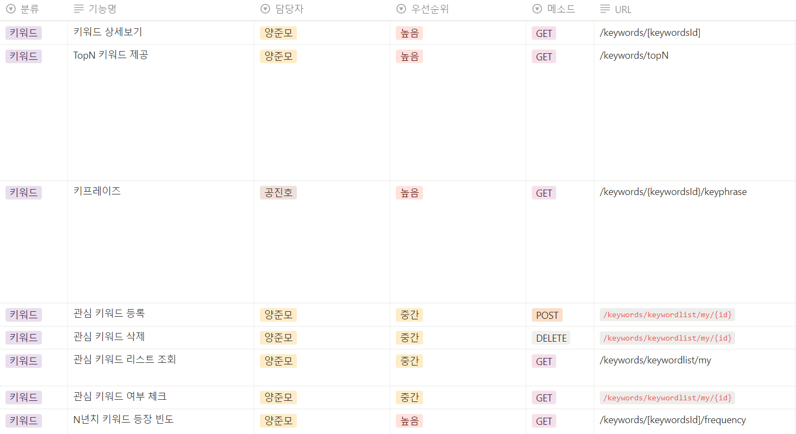

# 📈STOCKEY

---

#### 목차

1. [서비스 개요](#📊서비스-개요)

2. [서비스 화면](#💻서비스-화면)

3. [주요 기능](#✨주요-기능)

4. [기술 특이점](#✨기술-특이점)

5. [개발 환경](#⚙개발-환경)

6. [시스템 아키텍처](#🧬시스템-아키텍처)

7. [기획 및 설계](#📜기획-및-설계)

8. [팀원 소개](#👨‍👨‍👦‍👦팀원-소개)

### 📊서비스 개요

> 주식과 관련된 뉴스 기사의 키워드를 분석하여 주가 추이를 분석할 수 있는 웹 서비스

### 💻서비스 화면

##### 로그인


- 카카오 소셜 로그인 기능 제공

##### 메인 페이지(종목-메인)


- 입장시 종목-메인 페이지로 리다이렉트

- 랜덤하게 선정된 종목의 키워드 정보 제공

- 종목명을 검색하여 상세 페이지 조회 가능

##### 종목-상세


- 종목의 간략한 개요 및 주가 추이 차트 제공

- 주가 차트에서 설정한 기간 내의 해당 종목, 소속 산업, 경제 일반의 관련 뉴스 기사로부터 분석한 등장 빈도가 높은 키워드 정보 제공

- 키워드 차트에서 특정 키워드 클릭시 키워드의 등장 빈도 그래프와 주가 그래프의 상관계수, 관련 뉴스 기사 목록을 조회할 수 있는 키워드 패널 제공

##### 산업-메인


- 산업 분류 카드를 선택하여 해당 산업의 상세 페이지 조회

- 산업별 규모(소속 종목의 시가총액 합) 차트와 해당 산업 내 종목 시가총액 순위 표 조회

##### 산업-상세


- 산업의 간략한 설명과 규모 차트 제공

- 산업 내 시가총액 상위 5개 종목에 대한 버블 차트와 전체 종목 리스트 조회

- 규모 차트에서 설정한 기간 내의 뉴스 기사로부터 분석한 등장 빈도가 높은 키워드 정보 제공 및 종목 페이지에서와 유사한 키워드 패널 제공

##### 키워드-메인


- DB내 존재하는 키워드 검색 가능

##### 키워드-상세


- 종목이나 산업에 종속되지 않은 키워드 자체의 등장 빈도 그래프와 뉴스 기사 목록을 확인 가능

##### 마이 페이지


- 북마크한 종목, 산업, 키워드 목록을 한 번에 조회

### ✨주요 기능

- 종목, 산업, 또는 경제 일반의 뉴스 기사를 분석하여 추출된 키워드 정보를 제공하여 주가/산업 규모 차트 분석 및 이해
  
  - 뉴스 데이터에서 핵심 키워드, 키프레이즈를 추출하여 제공
  
  - 키워드 관련 뉴스 목록 제공
  
  - 주가/산업 규모 차트에서 유저가 직접 분석하고 싶은 기간을 설정 가능
  
  - 분석하고 싶은 뉴스 범위를 종목/산업/경제 일반 중 선택 가능
  
  - 피어슨 상관계수 분석을 통해 주가/산업 규모 차트와 키워드 언급량 그래프의 상관관계 분석

- 시가 총액 기준 상위 91개 종목과 22개 산업의 정보 제공
  
  - 주가(산업의 경우 시가총액 합) 추이 그래프, 간략한 개요 제공
  
  - 관련 키워드 정보를 담은 차트 제공
  
  - 특정 키워드 클릭시 해당 키워드의 등장 빈도 그래프, 종목(산업)과의 상관계수, 관련 기사 목록이 담긴 키워드 패널 제공

- 종목, 산업, 키워드별 관심 등록/해제 기능
  
  - 관심 등록한 목록을 북마크 페이지에서 조회 가능

- OAuth 2.0을 사용해 카카오 소셜 로그인 구현
  
  - JWT Access Token/Refresh Token을 이용한 로그인 인증 방식 적용
  - 닉네임 중복 확인

### ✨기술 특이점

- keyBERT 모델을 이용하여 뉴스에서 핵심 키워드 추출
  
  - 어느 뉴스에서나 사용되는 범용적인 단어, 종목명에 포함되는 단어 등을 불용어로 설정하여 분석 효과 상승

- 특정 키워드와 관련된 뉴스들 중에서 비슷한 내용을 가진 뉴스들끼리 그룹화
  
  - DBSCAN 모델 사용 (밀도 기반 클러스터링)
  
  - 코사인 유사도로 유사성 판단
  
  - 생성한 뉴스 그룹 중 그룹 사이즈가 일정 수준 이상인 그룹만 선별
  
  - 각 그룹마다 내용을 대표할 수 있는 키프레이즈를 한 개씩 제공(keyBERT 모델 이용)

- 키워드 관련 분석 제공
  
  - 분석 기간 내의 전체 뉴스 데이터 중 해당 키워드와 관련된 뉴스가 얼마나 있었는지를 언급량 그래프로 제공
  
  - 키워드 언급량 그래프와 주가/산업 규모 추이 그래프의 상관관계를 피어슨 상관계수 분석을 통해 계산하여 제공

- 상호작용을 중시한 차트 디자인
  
  - 마우스 호버, 클릭, 드래그 등 유저의 동작과 상호작용할 수 있는 차트 설계
  
  - 마우스 호버 시 툴팁으로 주가/산업 규모 등에 대한 상세 정보 제공
  
  - 키워드 차트 클릭시 키워드에 해당하는 키프레이즈 표시
  
  - 산업별 규모 차트 클릭시 해당 산업 내 시가총액 상위 5 종목 출력
  
  - 주가 차트에서 드래그 또는 네비게이터 조절을 통해 키워드 분석 기간 설정 가능

### ⚙개발 환경

**👩‍💻Backend**

Server

- Ubuntu 20.04 LTS

Spring Server

- JDK : Open JDK11

- SpringBoot : 2.7.9

Django Server

- Django : 4.2

- Python : 3.10.10

FastAPI Server

- FastAPI : 0.45

- Python : 3.7

Infra

- Nginx : 1.23.3

- Jenkins : 2.375.2

Database

- MySQL : 8.0.32

- Redis : 7.0.8

Tools

- VSCode : 1.73.1

- IntelliJ : 2022.03

**🎨Frontend**

- Node.js : 18.13.0

- React : 18.2.0

- Typescript: 4.9.5

- Library
  
  ```
  "@emotion/react": "^11.10.6",
  "@emotion/styled": "^11.10.6",
  "@mui/icons-material": "^5.11.16",
  "@mui/material": "^5.11.13",
  "@mui/material-next": "^6.0.0-alpha.79",
  "@tanstack/react-query": "^4.27.0",
  "@tanstack/react-query-devtools": "^4.27.0",
  "@testing-library/jest-dom": "^5.16.5",
  "@testing-library/react": "^13.4.0",
  "@testing-library/user-event": "^13.5.0",
  "@types/jest": "^27.5.2",
  "@types/node": "^16.18.16",
  "@types/papaparse": "^5.3.7",
  "@types/react": "^18.0.28",
  "@types/react-dom": "^18.0.11",
  "axios": "^1.3.4",
  "dayjs": "^1.11.7",
  "highcharts": "^10.3.3",
  "highcharts-border-radius": "^0.0.4",
  "highcharts-react-official": "^3.2.0",
  "papaparse": "^5.4.1",
  "react": "^18.2.0",
  "react-dom": "^18.2.0",
  "react-hook-form": "^7.43.7",
  "react-query": "^3.39.3",
  "react-router-dom": "^6.9.0",
  "react-scripts": "5.0.1",
  "recoil": "^0.7.7",
  "styled-components": "^5.3.9",
  "typescript": "^4.9.5",
  "web-vitals": "^2.1.4"
  ```

**🛠Management Tool**

- 형상 관리 : Gitlab, Git Fork

- 이슈 관리 : Jira

- 커뮤니케이션 : Mattermost, Webex, Notion

- 디자인 : Figma

### 🧬시스템 아키텍처


### 📜기획 및 설계

##### API 명세





##### 화면 설계

[화면 설계](https://www.figma.com/file/36WhLICCxdV5UR7gMzTk5V/STOCKEY?node-id=0-1&t=QqtQ7gjBH3HURFGm-0)


##### ERD


### 👨‍👨‍👦‍👦팀원 소개

| 공진호     | 김경희 | 김용현 | 김지영 | 양준모 | 이재협 |
|:-------:|:---:|:---:|:---:|:---:|:---:|
| 팀장 & BE | FE  | FE  | BE  | BE  | FE  |

- 공진호 : 팀장, 경제 뉴스 크롤링, 키워드 분석, 산업 api

- 김경희 : 노션/지라 관리, 디자인, 키워드 분석, 종목 페이지

- 김용현 : 디자인, 공통 컴포넌트, 로그인, 마이페이지, 발표

- 김지영 : CI/CD, 경제 뉴스 크롤링, 종목 api

- 양준모 : 경제 뉴스 크롤링, 키워드 분석, 회원관리, 키워드 api, UCC

- 이재협 : 디자인, 산업 페이지, 키워드 페이지, 서기
